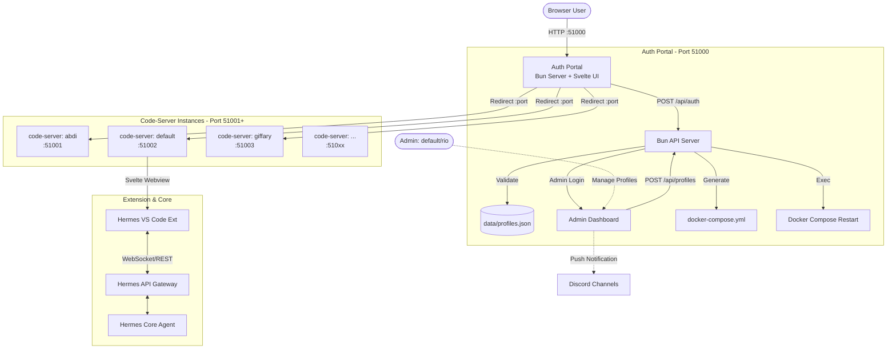
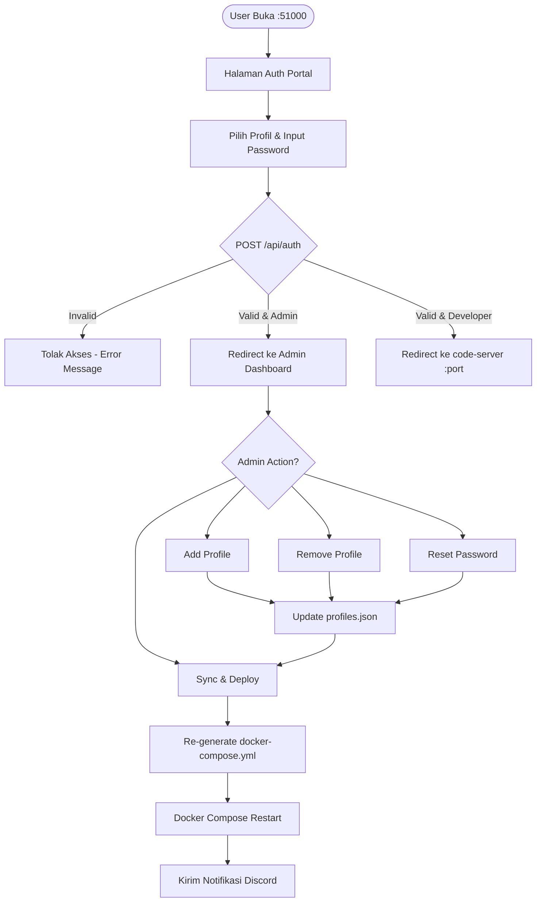

# PRD & SDLC: Hermes Agentic Browser IDE

## 1. Pendahuluan

### 1.1 Visi & Objektif
Membangun Browser IDE (berbasis code-server/OpenVSCode Server) yang terintegrasi penuh dengan mesin Hermes AI Agent. Tujuannya adalah menciptakan ruang kerja terisolasi per developer yang bisa diakses via browser dengan pengalaman "Vibe Coding" agentic tingkat lanjut, meminimalisir deviasi environment lokal antar tim.

### 1.2 Target Pengguna
Tim Developer Nusawork (Rio, Rianto, Sabrino, Giffary, Meysha, Abdi, Ryan, Aziz, Renanda, Ade). Setiap developer menggunakan profil dan environment masing-masing.

---

## 2. Analisis & Sintesis AI IDE

Arsitektur sistem ini mengadopsi dan mensintesis keunggulan dari 4 AI IDE modern:
1. **Qoder.com (Cloud Workspace & Expert Mode)**: Penggunaan *browser-based workspace* tanpa instalasi lokal. Serta fitur multi-agen orkestrasi (Planner, Coder, Reviewer) secara paralel.
2. **Google Antigravity (Checkpointing)**: Mekanisme step-by-step. Setiap rencana agent (Plan) berhenti dan memerlukan *approval* eksplisit (human-in-the-loop) sebelum kode ditulis (Implement).
3. **Windsurf (Inline Diff Interception)**: Mencegat *tool file writing*. Tidak langsung menimpa file, tetapi menampilkan antarmuka Diff Editor (Kiri: Kode Asli, Kanan: AI Kode) untuk di-Accept/Reject.
4. **Trae IDE (Builder Mode UX)**: Mengubah instruksi kompleks menjadi UI Checklist interaktif, memudahkan human memantau step mana yang sedang/sudah dikerjakan agent.

---

## 3. Fitur Utama Ekstensi Agentic Chat

Antarmuka *chat webview* di dalam VS Code (sidebar) yang sangat dinamis:
- **Rich Input Mentions (`@`)**: Mampu melampirkan konteks dengan cepat:
  - `@file` (memilih file di workspace)
  - `@folder` (memilih direktori)
  - `@rules` (membaca file guideline/aturan proyek)
  - `@terminal` (menarik output terminal aktif)
  - `@history` (mengakses log conversation sebelumnya)
  - `@mcp` (mengambil konteks dari Model Context Protocol server aktif)
- **Rich Input Actions (`/`)**: Navigasi shortcut ke command spesifik:
  - `/skills` (melihat daftar skill)
  - `/new-skill` (membuat skill baru dari percakapan berjalan)
  - `/expert` (mengaktifkan mode orkestrasi Qoder-style)
- **Attachments (`+`)**: Tombol untuk melampirkan *Image*, *File* (PDF, TXT, CSV), dan *Audio* (Voice Input) ke prompt.
- **Provider & Model Switcher**: Dropdown real-time di header chat untuk beralih antar Provider (OpenRouter, Anthropic, Custom, dll) dan Model yang ada, tanpa mengedit `.env` manual.
- **Vibe Workflow (Antigravity & Trae)**: Rendering respon teks biasa menjadi Checkpoint Plan, dilanjutkan Checkpoint Implementasi.
- **Vibe Diff Interception (Windsurf)**: Integrasi dengan command native `vscode.diff`.

---

## 4. Mekanisme Security & Onboarding (RBAC)

Keamanan akses IDE ini diatur sangat ketat untuk menghindari akses tidak sah.

### 4.1 Auth Portal sebagai Master Dashboard
Auth Portal bukan hanya halaman login — ia adalah **fullstack app** (Svelte frontend + Bun API backend) yang menjadi pusat manajemen seluruh profil IDE.

**Backend API (`Bun.serve`):**
- Melayani static files UI Svelte dan menyediakan endpoint REST `/api/profiles`.
- Data profil disimpan di `apps/auth-portal/data/profiles.json`.
- Mampu men-generate ulang `docker-compose.yml` dan me-restart container Docker secara otomatis.

**Port Allocation (Otomatis & Alfabetis):**
- Port `51000` — Auth Portal (Bun server).
- Port `51001+` — Code-server instances, dialokasikan otomatis berdasarkan **urutan abjad** nama profil.
- Contoh: abdi=51001, default=51002, giffary=51003, meysha=51004, renanda=51005, rianto=51006, rio=51007, ryan=51008, sabrino=51009.
- Saat profil ditambah/dihapus, seluruh port di-*reallocate* ulang agar tetap urut.

### 4.2 Role-Based Access
1. **Profil `default` (Master/Admin)**:
   - Login dengan profil `default` akan masuk ke **Admin Dashboard** (bukan redirect ke code-server).
   - Dari dashboard ini, admin bisa:
     - Melihat daftar semua profil beserta status & port.
     - Menambah profil baru (nama + password).
     - Menghapus profil.
     - Mengubah/reset password profil.
     - Menekan tombol **"Sync & Deploy"** untuk men-generate ulang `docker-compose.yml` dan me-restart seluruh container.
2. **Profil `rio` (Co-Admin)**:
   - Memiliki hak yang sama dengan `default` untuk manajemen profil.
3. **Profil lainnya (Developer)**:
   - Hanya bisa login dan langsung di-redirect ke code-server instance miliknya.
   - Tidak memiliki akses ke Admin Dashboard.

### 4.3 Autentikasi & Routing
1. **Autentikasi Tersentralisasi**: Auth Portal memvalidasi password terhadap `profiles.json` via API backend.
2. **Direct Port Routing**: Setelah validasi sukses, user di-redirect langsung ke port code-server miliknya (tanpa reverse proxy path-based). Keamanan code-server tetap dijaga oleh password native bawaan code-server yang di-sync dari `profiles.json`.
3. **Distribusi Kredensial Otomatis**: Jika admin melakukan set/reset password, sistem mengirimkan notifikasi beserta kredensial baru ke channel Discord terkait.
4. **Auto-Login Extension**: Ekstensi di dalam instance otomatis menyerap context environment profil dan menghubungkan diri langsung ke *Hermes API Gateway*.

---

## 5. Arsitektur Sistem & Diagram

### 5.1 System Architecture



### 5.2 Security Flowchart



---

## 6. Design System & Tech Stack

- **Framework Webview Ekstensi & Auth Portal**: **Svelte**. (Alasan: Reaktivitas tingkat compiler, *bundle size* super kecil yang krusial untuk performa Extension Webview VS Code).
- **Styling**: Tailwind CSS terintegrasi dengan **VS Code Webview UI Toolkit** (memanfaatkan *CSS variables* native VS Code `var(--vscode-*)` agar ekstensi otomatis mengikuti tema IDE).
- **Runtime & Build Tool**: **Bun** (super cepat untuk package manager dan runtime) + Vite.
- **Infrastruktur Workspace**: OpenVSCode Server (linuxserver/code-server), di-deploy dalam container terisolasi (Docker). Tanpa reverse proxy — setiap profil diekspos langsung di port unik (range `51001+`, urut abjad).
- **Auth Portal Backend**: `Bun.serve` — melayani static Svelte UI + REST API untuk manajemen profil, generate docker-compose, dan restart container.

---

## 7. Struktur Folder (Monorepo)

Proyek akan dijalankan sebagai *Monorepo* menggunakan Bun workspaces.

```text
hermes-ide-extension/
├── package.json (Bun Monorepo Root)
├── bun.lockb
├── PRD.md
├── apps/
│   ├── auth-portal/              # Fullstack App: Svelte UI + Bun API Server
│   │   ├── src/                  # Svelte Frontend
│   │   │   ├── App.svelte        # Login Page
│   │   │   ├── Dashboard.svelte  # Admin Dashboard (profile management)
│   │   │   └── main.ts
│   │   ├── server/               # Bun Backend API
│   │   │   ├── index.ts          # Bun.serve entry point (static + API)
│   │   │   ├── routes/           # API route handlers
│   │   │   │   ├── auth.ts       # POST /api/auth
│   │   │   │   ├── profiles.ts   # GET/POST/PUT/DELETE /api/profiles
│   │   │   │   └── deploy.ts     # POST /api/deploy (sync & restart)
│   │   │   └── lib/
│   │   │       ├── docker.ts     # Docker compose generator & restart
│   │   │       └── discord.ts    # Discord notification helper
│   │   ├── data/
│   │   │   └── profiles.json     # Master profile database
│   │   ├── vite.config.ts
│   │   └── package.json
│   └── code-server-infra/        # Generated by Auth Portal API
│       ├── docker-compose.yml    # Auto-generated, do NOT edit manually
│       └── workspace-*/          # Per-profile workspace volumes
└── extension/                    # VS Code Extension Utama (Phase 3+)
    ├── package.json
    ├── src/                      # Extension Host (Node.js/TS)
    │   ├── extension.ts
    │   ├── providers/            # ChatViewProvider
    │   ├── utils/                # Interceptors (Diff, File)
    │   └── gateway/              # Hermes API Client
    └── webview-ui/               # Svelte App untuk Sidebar UI
        ├── src/
        │   ├── components/       # Chat, Attachments, Checklists
        │   ├── App.svelte
        │   └── main.ts
        └── vite.config.ts
```

---

## 8. Development Phases & SDLC

### **Phase 1: Auth Portal Fullstack & Infrastruktur Workspace**
- Inisialisasi Bun Monorepo.
- Development Auth Portal sebagai **fullstack app** (Svelte UI + Bun API backend).
- Implementasi Login Page & Admin Dashboard.
- Backend API: manajemen profil (CRUD), auto port allocation (abjad), generate `docker-compose.yml`, restart Docker container.
- Konfigurasi `apps/code-server-infra/` — auto-generated oleh API, bukan diedit manual.
- Port scheme: `51000` Auth Portal, `51001+` code-server instances (urut abjad).

### **Phase 2: RBAC, Kredensial & Notifikasi**
- Implementasi role-based access: `default`/`rio` sebagai admin, lainnya developer.
- Flow reset password dari Admin Dashboard.
- Integrasi push notifikasi via API Discord ketika ada pembaruan kredensial.
- Password sync: password di `profiles.json` otomatis disinkronkan ke environment Docker container.

### **Phase 3: Extension Boilerplate & Gateway Connection**
- Setup `extension/` menggunakan `yo code` template disesuaikan dengan Svelte+Vite.
- Development `ChatViewProvider` di Extension Host.
- Menyambungkan ekstensi dengan Hermes API Gateway (REST/WebSocket).

### **Phase 4: Svelte Webview & Core Chat UX**
- Development `webview-ui/`.
- Implementasi sistem Chat UI dasar.
- Pembuatan fitur *Rich Input* Mentions (`@file`, `@folder`, dll).
- Pembuatan fitur *Rich Input* Actions (`/skills`, `/expert`).
- Implementasi fitur *Attachments* Button (Image, File, Audio) dan Header Dropdown (Model/Provider Switcher).

### **Phase 5: Antigravity Checkpoints & Trae UI (Builder Mode)**
- Parser *response* dari Hermes Agent ke format Checkpoint UI (Svelte components).
- Pembuatan mekanisme status penahan (*paused execution*) saat Plan diajukan.
- UI Checklist *Approve/Revise* Button yang dihubungkan kembali ke Gateway.

### **Phase 6: Windsurf Diff Interception**
- Di Extension Host: membuat *middleware* penangkap eksekusi tool `write_file` & `patch` dari Hermes.
- Integrasi ke API `vscode.diff`.
- UI *overlay* "Accept / Reject" untuk menulis kode langsung ke disk jika di-Accept.

### **Phase 7: Qoder Expert Mode & Orchestration**
- Implementasi command `/expert`.
- Merender UI *Tree View* proses sub-agen (Planner, Coder, Reviewer).
- Pengikatan state Webview ke tool `delegate_task` Hermes API.

### **Phase 8: Pengujian & CI/CD**
- Integrasi E2E Testing (Playwright / @vscode/test-electron).
- Packaging extension `.vsix`.
- Dokumentasi instalasi lengkap per profil.
