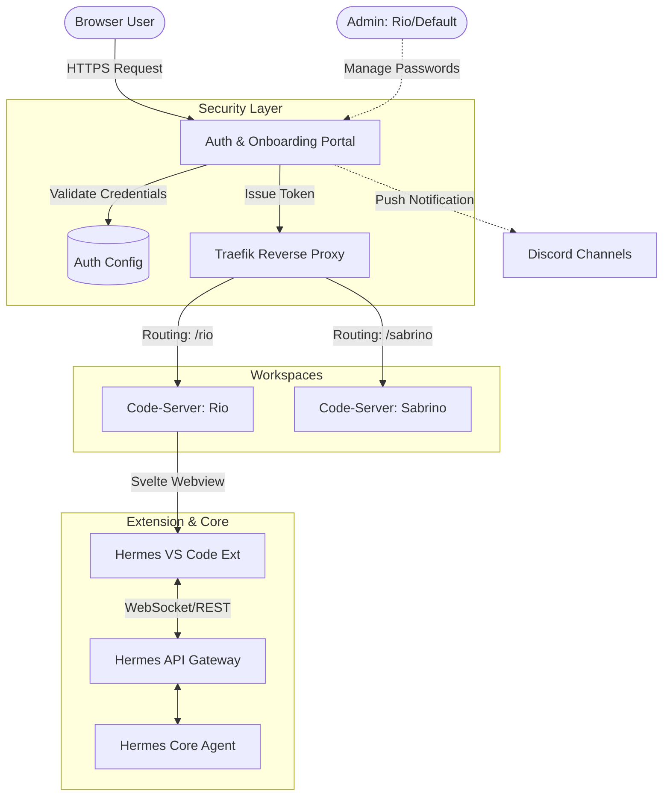
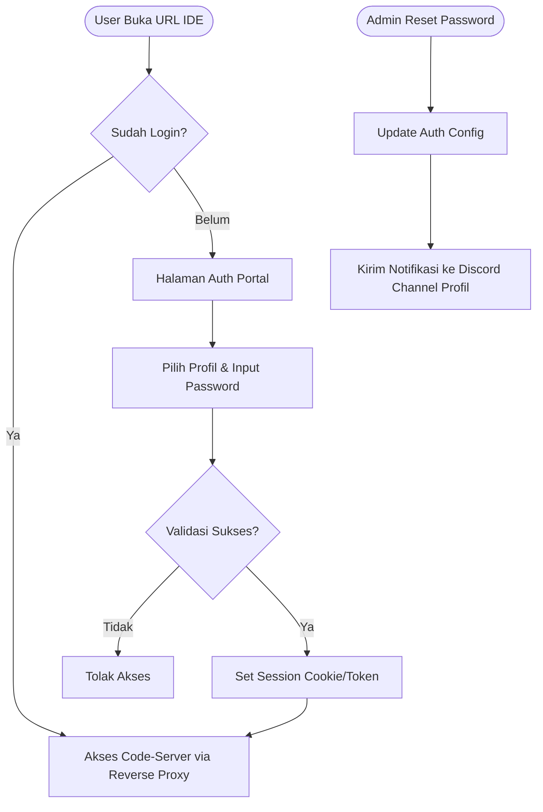

# PRD & SDLC: Hermes Agentic Browser IDE

## 1. Pendahuluan

### 1.1 Visi & Objektif
Membangun Browser IDE (berbasis code-server/OpenVSCode Server) yang terintegrasi penuh dengan mesin Hermes AI Agent. Tujuannya adalah menciptakan ruang kerja terisolasi per developer yang bisa diakses via browser dengan pengalaman "Vibe Coding" agentic tingkat lanjut, meminimalisir deviasi environment lokal antar tim.

### 1.2 Target Pengguna
Tim Developer Nusawork (Rio, Rianto, Sabrino, Giffary, Meysha, Abdi, Ryan, Aziz, Renanda, Ade). Setiap developer menggunakan profil dan environment masing-masing.

---

## 2. Analisis & Sintesis AI IDE

Arsitektur sistem ini mengadopsi dan mensintesis keunggulan dari 4 AI IDE modern:
1. **Qoder.com (Cloud Workspace & Expert Mode)**: Penggunaan *browser-based workspace* tanpa instalasi lokal. Serta fitur multi-agen orkestrasi (Planner, Coder, Reviewer) secara paralel.
2. **Google Antigravity (Checkpointing)**: Mekanisme step-by-step. Setiap rencana agent (Plan) berhenti dan memerlukan *approval* eksplisit (human-in-the-loop) sebelum kode ditulis (Implement).
3. **Windsurf (Inline Diff Interception)**: Mencegat *tool file writing*. Tidak langsung menimpa file, tetapi menampilkan antarmuka Diff Editor (Kiri: Kode Asli, Kanan: AI Kode) untuk di-Accept/Reject.
4. **Trae IDE (Builder Mode UX)**: Mengubah instruksi kompleks menjadi UI Checklist interaktif, memudahkan human memantau step mana yang sedang/sudah dikerjakan agent.

---

## 3. Fitur Utama Ekstensi Agentic Chat

Antarmuka *chat webview* di dalam VS Code (sidebar) yang sangat dinamis:
- **Rich Input Mentions (`@`)**: Mampu melampirkan konteks dengan cepat:
  - `@file` (memilih file di workspace)
  - `@folder` (memilih direktori)
  - `@rules` (membaca file guideline/aturan proyek)
  - `@terminal` (menarik output terminal aktif)
  - `@history` (mengakses log conversation sebelumnya)
  - `@mcp` (mengambil konteks dari Model Context Protocol server aktif)
- **Rich Input Actions (`/`)**: Navigasi shortcut ke command spesifik:
  - `/skills` (melihat daftar skill)
  - `/new-skill` (membuat skill baru dari percakapan berjalan)
  - `/expert` (mengaktifkan mode orkestrasi Qoder-style)
- **Attachments (`+`)**: Tombol untuk melampirkan *Image*, *File* (PDF, TXT, CSV), dan *Audio* (Voice Input) ke prompt.
- **Provider & Model Switcher**: Dropdown real-time di header chat untuk beralih antar Provider (OpenRouter, Anthropic, Custom, dll) dan Model yang ada, tanpa mengedit `.env` manual.
- **Vibe Workflow (Antigravity & Trae)**: Rendering respon teks biasa menjadi Checkpoint Plan, dilanjutkan Checkpoint Implementasi.
- **Vibe Diff Interception (Windsurf)**: Integrasi dengan command native `vscode.diff`.

---

## 4. Mekanisme Security & Onboarding (RBAC)

Keamanan akses IDE ini diatur sangat ketat untuk menghindari akses tidak sah.
1. **Autentikasi Tersentralisasi**: Tiap profil dilindungi *Password/Passkey*.
2. **Role-Based Access Control (RBAC)**: Form login hanya bersifat *read-only* bagi developer biasa. Hanya akun dengan level administrator (profil `rio` atau `default`) yang memiliki hak untuk melakukan ubah/reset *password* pengguna lain.
3. **Distribusi Kredensial Otomatis**: Jika profil `rio` melakukan set/reset password untuk `sabrino`, sistem akan secara otomatis mengirimkan notifikasi beserta kredensial barunya langsung ke channel Discord Nusawork terkait profil `sabrino`.
4. **Auto-Routing**: Ketika kredensial disubmit, *Reverse Proxy* (Traefik) membaca token/cookie, lalu me-*route* trafiks ke instance Container (Docker/LXC) milik developer tersebut.
5. **Auto-Login Extension**: Ekstensi di dalam instance otomatis menyerap context environment profil dan menghubungkan diri langsung ke *Hermes API Gateway*.

---

## 5. Arsitektur Sistem & Diagram

### 5.1 System Architecture



### 5.2 Security Flowchart



---

## 6. Design System & Tech Stack

- **Framework Webview Ekstensi & Auth Portal**: **Svelte**. (Alasan: Reaktivitas tingkat compiler, *bundle size* super kecil yang krusial untuk performa Extension Webview VS Code).
- **Styling**: Tailwind CSS terintegrasi dengan **VS Code Webview UI Toolkit** (memanfaatkan *CSS variables* native VS Code `var(--vscode-*)` agar ekstensi otomatis mengikuti tema IDE).
- **Runtime & Build Tool**: **Bun** (super cepat untuk package manager dan runtime) + Vite.
- **Infrastruktur Workspace**: OpenVSCode Server (linuxserver/code-server), di-deploy dalam container terisolasi (Docker).
- **Reverse Proxy & Routing**: Traefik (mendukung dynamic routing berbasis cookie/header).

---

## 7. Struktur Folder (Monorepo)

Proyek akan dijalankan sebagai *Monorepo* menggunakan Bun workspaces.

```text
hermes-ide-extension/
├── package.json (Bun Monorepo Root)
├── bun.lockb
├── apps/
│   ├── auth-portal/          # SvelteKit App untuk Onboarding & Login
│   │   ├── src/
│   │   └── Dockerfile
│   └── code-server-infra/    # Konfigurasi Infrastruktur IDE
│       ├── docker-compose.yml
│       ├── traefik/
│       └── scripts/          # Script reset password & notif Discord
└── extension/                # VS Code Extension Utama
    ├── package.json
    ├── src/                  # Extension Host (Node.js/TS)
    │   ├── extension.ts
    │   ├── providers/        # ChatViewProvider
    │   ├── utils/            # Interceptors (Diff, File)
    │   └── gateway/          # Hermes API Client
    └── webview-ui/           # Svelte App untuk Sidebar UI
        ├── src/
        │   ├── components/   # Chat, Attachments, Checklists
        │   ├── App.svelte
        │   └── main.ts
        └── vite.config.ts
```

---

## 8. Development Phases & SDLC

### **Phase 1: Infrastruktur Security & Workspace Dasar**
- Inisialisasi Bun Monorepo.
- Konfigurasi `apps/code-server-infra/` (Docker Compose untuk Traefik dan 1 mock code-server instance).
- Pembuatan sistem *routing* statis.

### **Phase 2: Auth Portal & RBAC Development**
- Development `apps/auth-portal/` menggunakan SvelteKit.
- Pembuatan flow Login dan Role-Based Access Control.
- Script *management password* (Admin only).
- Integrasi push notifikasi via API Discord/Hermes Gateway ketika ada perbaruan kredensial.

### **Phase 3: Extension Boilerplate & Gateway Connection**
- Setup `extension/` menggunakan `yo code` template disesuaikan dengan Svelte+Vite.
- Development `ChatViewProvider` di Extension Host.
- Menyambungkan ekstensi dengan Hermes API Gateway (REST/WebSocket).

### **Phase 4: Svelte Webview & Core Chat UX**
- Development `webview-ui/`.
- Implementasi sistem Chat UI dasar.
- Pembuatan fitur *Rich Input* Mentions (`@file`, `@folder`, dll).
- Pembuatan fitur *Rich Input* Actions (`/skills`, `/expert`).
- Implementasi fitur *Attachments* Button (Image, File, Audio) dan Header Dropdown (Model/Provider Switcher).

### **Phase 5: Antigravity Checkpoints & Trae UI (Builder Mode)**
- Parser *response* dari Hermes Agent ke format Checkpoint UI (Svelte components).
- Pembuatan mekanisme status penahan (*paused execution*) saat Plan diajukan.
- UI Checklist *Approve/Revise* Button yang dihubungkan kembali ke Gateway.

### **Phase 6: Windsurf Diff Interception**
- Di Extension Host: membuat *middleware* penangkap eksekusi tool `write_file` & `patch` dari Hermes.
- Integrasi ke API `vscode.diff`.
- UI *overlay* "Accept / Reject" untuk menulis kode langsung ke disk jika di-Accept.

### **Phase 7: Qoder Expert Mode & Orchestration**
- Implementasi command `/expert`.
- Merender UI *Tree View* proses sub-agen (Planner, Coder, Reviewer).
- Pengikatan state Webview ke tool `delegate_task` Hermes API.

### **Phase 8: Pengujian & CI/CD**
- Integrasi E2E Testing (Playwright / @vscode/test-electron).
- Packaging extension `.vsix`.
- Dokumentasi instalasi lengkap per profil.
