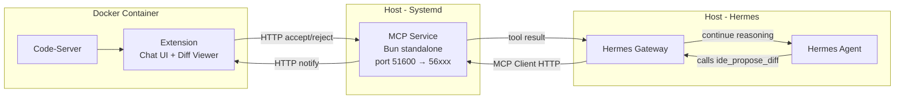
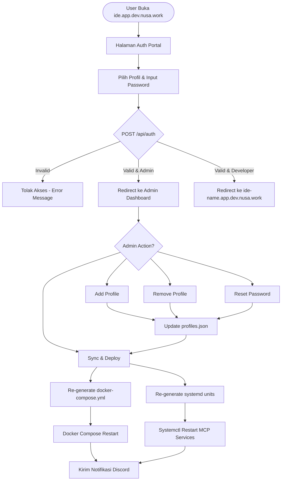
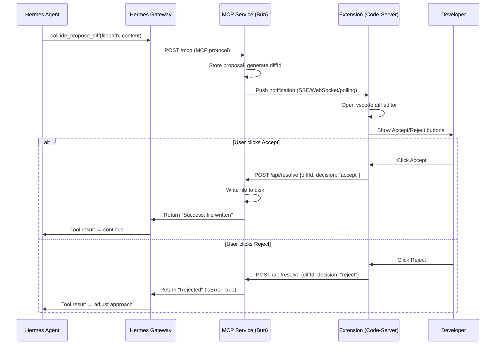

# PRD & SDLC: Hermes Agentic Browser IDE

> **Revision 2.0** — 15 Juni 2026
> Arsitektur di-update ke model **Hybrid**: Docker Code-Server + MCP Service terpisah (Systemd/Bun).

## 1. Pendahuluan

### 1.1 Visi & Objektif
Membangun Browser IDE (berbasis code-server/OpenVSCode Server) yang terintegrasi penuh dengan mesin Hermes AI Agent. Tujuannya adalah menciptakan ruang kerja terisolasi per developer yang bisa diakses via browser dengan pengalaman "Vibe Coding" agentic tingkat lanjut, meminimalisir deviasi environment lokal antar tim.

### 1.2 Target Pengguna
Tim Developer Nusawork (Rio, Rianto, Sabrino, Giffary, Meysha, Abdi, Ryan, Aziz, Renanda, Ade, Yudi). Setiap developer menggunakan profil dan environment masing-masing.

---

## 2. Analisis & Sintesis AI IDE

Arsitektur sistem ini mengadopsi dan mensintesis keunggulan dari 4 AI IDE modern:
1. **Qoder.com (Cloud Workspace & Expert Mode)**: Penggunaan *browser-based workspace* tanpa instalasi lokal. Serta fitur multi-agen orkestrasi (Planner, Coder, Reviewer) secara paralel.
2. **Google Antigravity (Checkpointing)**: Mekanisme step-by-step. Setiap rencana agent (Plan) berhenti dan memerlukan *approval* eksplisit (human-in-the-loop) sebelum kode ditulis (Implement).
3. **Windsurf (Inline Diff Interception)**: Mencegat *tool file writing*. Tidak langsung menimpa file, tetapi menampilkan antarmuka Diff Editor (Kiri: Kode Asli, Kanan: AI Kode) untuk di-Accept/Reject.
4. **Trae IDE (Builder Mode UX)**: Mengubah instruksi kompleks menjadi UI Checklist interaktif, memudahkan human memantau step mana yang sedang/sudah dikerjakan agent.

---

## 3. Fitur Utama Ekstensi Agentic Chat

Antarmuka *chat webview* di dalam VS Code (sidebar) yang sangat dinamis:
- **Rich Input Mentions (`@`)**: Mampu melampirkan konteks dengan cepat:
  - `@file` (memilih file di workspace)
  - `@folder` (memilih direktori)
  - `@rules` (membaca file guideline/aturan proyek)
  - `@terminal` (menarik output terminal aktif)
  - `@history` (mengakses log conversation sebelumnya)
  - `@mcp` (mengambil konteks dari Model Context Protocol server aktif)
- **Rich Input Actions (`/`)**: Navigasi shortcut ke command spesifik:
  - `/skills` (melihat daftar skill)
  - `/new-skill` (membuat skill baru dari percakapan berjalan)
  - `/expert` (mengaktifkan mode orkestrasi Qoder-style)
- **Attachments (`+`)**: Tombol untuk melampirkan *Image*, *File* (PDF, TXT, CSV), dan *Audio* (Voice Input) ke prompt.
- **Provider & Model Switcher**: Dropdown real-time di header chat untuk beralih antar Provider (OpenRouter, Anthropic, Custom, dll) dan Model yang ada, tanpa mengedit `.env` manual.
- **Vibe Workflow (Antigravity & Trae)**: Rendering respon teks biasa menjadi Checkpoint Plan, dilanjutkan Checkpoint Implementasi.
- **Vibe Diff Interception (Windsurf)**: Integrasi dengan command native `vscode.diff`, di-trigger oleh MCP Service eksternal.

---

## 4. Mekanisme Security & Onboarding (RBAC)

Keamanan akses IDE ini diatur sangat ketat untuk menghindari akses tidak sah.

### 4.1 Auth Portal sebagai Master Dashboard
Auth Portal bukan hanya halaman login — ia adalah **fullstack app** (Svelte frontend + Bun API backend) yang menjadi pusat manajemen seluruh profil IDE.

**Backend API (`Bun.serve`):**
- Melayani static files UI Svelte dan menyediakan endpoint REST `/api/profiles`.
- Data profil disimpan di `apps/auth-portal/data/profiles.json`.
- Mampu men-generate ulang `docker-compose.yml`, MCP systemd unit files, dan me-restart seluruh services secara otomatis.

**Port Allocation (Otomatis & Alfabetis):**
- Port `51000` — Auth Portal (Bun server).
- Port `51001+` — Code-server instances, dialokasikan otomatis berdasarkan **urutan abjad** nama profil.
- Contoh: abdi=51001, default=51002, giffary=51003, meysha=51004, renanda=51005, rianto=51006, rio=51007, ryan=51008, sabrino=51009.
- Saat profil ditambah/dihapus, seluruh port di-*reallocate* ulang agar tetap urut.

### 4.2 Role-Based Access
1. **Profil `default` (Master/Admin)**:
   - Login dengan profil `default` akan masuk ke **Admin Dashboard** (bukan redirect ke code-server).
   - Dari dashboard ini, admin bisa:
     - Melihat daftar semua profil beserta status & port.
     - Menambah profil baru (nama + password).
     - Menghapus profil.
     - Mengubah/reset password profil.
     - Menekan tombol **"Sync & Deploy"** untuk men-generate ulang `docker-compose.yml`, MCP systemd units, dan me-restart seluruh services.
2. **Profil `rio` (Co-Admin)**:
   - Memiliki hak yang sama dengan `default` untuk manajemen profil.
3. **Profil lainnya (Developer)**:
   - Hanya bisa login dan langsung di-redirect ke code-server instance miliknya.
   - Tidak memiliki akses ke Admin Dashboard.

### 4.3 Autentikasi & Routing
1. **Autentikasi Tersentralisasi**: Auth Portal memvalidasi password terhadap `profiles.json` via API backend.
2. **Domain-Based Routing**: Setiap profil memiliki subdomain sendiri `ide-{name}.app.dev.nusa.work`. Setelah validasi sukses, user di-redirect ke subdomain code-server miliknya. HTTPS dan wildcard cert dikelola oleh Nginx di host.
3. **Distribusi Kredensial Otomatis**: Jika admin melakukan set/reset password, sistem mengirimkan notifikasi beserta kredensial baru ke channel Discord terkait.
4. **Auto-Login Extension**: Ekstensi di dalam instance otomatis menyerap context environment profil dan menghubungkan diri langsung ke *Hermes API Gateway*.

---

## 5. Arsitektur Sistem & Diagram

### 5.1 System Architecture (Hybrid)

```mermaid
graph TD
    User([Browser User]) -->|HTTPS| Nginx[Nginx Reverse Proxy<br/>*.app.dev.nusa.work]
    
    Nginx -->|ide.app.dev.nusa.work| AP[Auth Portal<br/>Bun Server + Svelte UI<br/>:51000]
    Nginx -->|ide-{name}.app.dev.nusa.work| CS[Code-Server Container<br/>Docker per-profile]
    Nginx -->|ide-{name}.app.dev.nusa.work/mcp| MCP[MCP Service<br/>Bun standalone<br/>127.0.0.1:56xxx]
    
    subgraph Auth Portal
        AP --> API[Bun API Server]
        API --> DB[(data/profiles.json)]
        API -->|Admin| Dashboard[Admin Dashboard]
        Dashboard -->|Sync & Deploy| API
        API -->|Generate| DCY[docker-compose.yml]
        API -->|Generate| SYS[systemd unit files]
        API -->|Restart| Docker[Docker + Systemd]
    end
    
    subgraph Docker Containers
        CS1[hermes-ide-abdi]
        CS2[hermes-ide-rio]
        CS3[hermes-ide-ryan]
        CSn[hermes-ide-...]
    end

    subgraph MCP Services - Systemd
        MCP1["mcp-abdi.service<br/>127.0.0.1:56001"]
        MCP2["mcp-rio.service<br/>127.0.0.1:56007"]
        MCP3["mcp-ryan.service<br/>127.0.0.1:56008"]
        MCPn["mcp-....service<br/>127.0.0.1:56xxx"]
    end
    
    subgraph Extension & Core
        CS2 -->|Svelte Webview| Ext[Hermes VS Code Extension<br/>Chat UI + Diff Viewer only]
        Ext <-->|REST/SSE| HG[Hermes API Gateway]
        Ext <-->|HTTP localhost| MCP2
        HG <-->|MCP Client| MCP2
        HG <--> Core[Hermes Core Agent]
    end
    
    Admin([Admin: default/rio]) -.->|Manage| Dashboard
    Dashboard -.->|Notification| Discord[Discord Channels]
```

### 5.2 Hybrid Architecture Detail



**Alur `ide_propose_diff`:**
1. Agent memanggil tool `mcp_ide_ide_propose_diff(filepath, new_content)`
2. Hermes Gateway meneruskan ke MCP Service via HTTP POST
3. MCP Service menyimpan proposal dan **mengirim notifikasi ke Extension** (via HTTP push / polling)
4. Extension membuka Diff Editor (`vscode.diff`) dan menampilkan tombol Accept/Reject
5. User klik Accept → Extension mengirim decision ke MCP Service via HTTP
6. MCP Service resolve Promise → mengembalikan result ke Gateway → Agent melanjutkan

### 5.3 Mengapa Hybrid?

| Masalah Lama (MCP di Extension Host) | Solusi Hybrid |
|---|---|
| MCP server baru start saat browser connect (Extension Host lifecycle terikat WebSocket) | MCP Service jalan 24/7 via systemd, independen dari browser |
| Docker cache agresif — extension install sering gagal/stuck versi lama | Extension tetap ada tapi lebih ringan (UI only). MCP Service di-update independen tanpa sentuh extension |
| Single-session transport — reconnect = 400 error | Multi-session transport di standalone service, lebih stabil |
| Debug susah — error silent di container | MCP Service bisa di-debug via `journalctl`, restart instan via `systemctl` |

### 5.4 Security Flowchart



---

## 6. Design System & Tech Stack

- **Framework Webview Ekstensi & Auth Portal**: **Svelte 5**. (Alasan: Reaktivitas tingkat compiler, *bundle size* super kecil yang krusial untuk performa Extension Webview VS Code).
- **Styling**: Tailwind CSS terintegrasi dengan **VS Code Webview UI Toolkit** (memanfaatkan *CSS variables* native VS Code `var(--vscode-*)` agar ekstensi otomatis mengikuti tema IDE).
- **Runtime & Build Tool**: **Bun** (super cepat untuk package manager dan runtime) + Vite + esbuild.
- **MCP Server**: **Bun standalone** + Hono + `@modelcontextprotocol/sdk` (`WebStandardStreamableHTTPServerTransport`). Dijalankan sebagai systemd service terpisah dari container Docker.
- **Infrastruktur Workspace**: OpenVSCode Server (linuxserver/code-server), di-deploy dalam container terisolasi (Docker).
- **Reverse Proxy**: Nginx dengan wildcard subdomain `*.app.dev.nusa.work`. Route `/mcp` di-proxy ke MCP Service lokal.
- **Auth Portal Backend**: `Bun.serve` — melayani static Svelte UI + REST API untuk manajemen profil, generate docker-compose + systemd units, dan restart services.
- **MCP Transport**: HTTP Streamable (Stateful multi-session). Setiap client initialize request membuat session baru (Server + Transport pair). Session di-cleanup otomatis setelah 30 menit idle.

---

## 7. Struktur Folder (Monorepo)

Proyek dijalankan sebagai *Monorepo* menggunakan Bun workspaces.

```text
hermes-ide-extension/
├── package.json                  # Bun Monorepo Root
├── bun.lock
├── PRD.md                        # Dokumen ini
├── MCP_IMPLEMENTATION_PLAN.md    # Detail teknis MCP (legacy, lihat PRD)
├── apps/
│   ├── auth-portal/              # Fullstack App: Svelte UI + Bun API Server
│   │   ├── src/                  # Svelte Frontend
│   │   │   ├── App.svelte        # Login Page
│   │   │   ├── Dashboard.svelte  # Admin Dashboard (profile management)
│   │   │   └── main.ts
│   │   ├── server/               # Bun Backend API
│   │   │   ├── index.ts          # Bun.serve entry point (static + API)
│   │   │   ├── routes/           # API route handlers
│   │   │   │   ├── auth.ts       # POST /api/auth
│   │   │   │   ├── profiles.ts   # GET/POST/PUT/DELETE /api/profiles
│   │   │   │   └── deploy.ts     # POST /api/deploy (sync & restart)
│   │   │   └── lib/
│   │   │       ├── docker.ts     # Docker compose + systemd unit generator
│   │   │       └── discord.ts    # Discord notification helper
│   │   ├── data/
│   │   │   └── profiles.json     # Master profile database
│   │   ├── templates/
│   │   │   └── mcp-service.unit  # Systemd unit template for MCP services
│   │   ├── vite.config.ts
│   │   └── package.json
│   ├── mcp-service/              # Standalone MCP Service (NEW)
│   │   ├── src/
│   │   │   └── index.ts          # Bun.serve + Hono + MCP SDK
│   │   ├── package.json
│   │   └── tsconfig.json
│   ├── extension/                # VS Code Extension (Lightweight UI)
│   │   ├── package.json
│   │   ├── esbuild.js            # Build config
│   │   ├── src/                  # Extension Host (Node.js/TS)
│   │   │   ├── extension.ts      # Activation, commands
│   │   │   ├── ChatViewProvider.ts  # Webview bridge
│   │   │   ├── HermesClient.ts   # Hermes API client (SSE)
│   │   │   └── McpBridge.ts      # HTTP client to MCP Service (NEW, replaces mcpServer.ts)
│   │   └── dist/                 # Built output
│   │       └── extension.js
│   ├── webview-ui/               # Svelte App untuk Sidebar UI
│   │   ├── src/
│   │   │   ├── components/
│   │   │   │   ├── ChatBubble.svelte
│   │   │   │   ├── ChatHeader.svelte
│   │   │   │   ├── ChatInput.svelte
│   │   │   │   ├── DiffAlert.svelte
│   │   │   │   ├── TypingIndicator.svelte
│   │   │   │   └── WelcomeScreen.svelte
│   │   │   ├── lib/
│   │   │   │   ├── store.ts
│   │   │   │   ├── types.ts
│   │   │   │   └── vscode.ts
│   │   │   ├── App.svelte
│   │   │   └── main.ts
│   │   └── vite.config.ts
│   └── code-server-infra/        # Generated by Auth Portal API
│       ├── docker-compose.yml    # Auto-generated, do NOT edit manually
│       └── config-*/             # Per-profile config volumes
└── scripts/
    └── deploy-mcp.sh             # Script deploy MCP service per-profile
```

### 7.1 Perubahan Arsitektur dari PRD v1

| Komponen | PRD v1 | PRD v2 (Hybrid) |
|---|---|---|
| MCP Server | Di dalam Extension Host (Node.js subprocess `bun run mcpStandalone.js`) | Standalone systemd service (`apps/mcp-service/`) |
| Extension | Chat UI + MCP Manager + Diff Editor + IPC subprocess | Chat UI + Diff Viewer saja. MCP Bridge via HTTP |
| Komunikasi Extension ↔ MCP | IPC stdin/stdout JSON lines | HTTP REST (polling/push notifications) |
| Deploy MCP | Embedded di `.vsix` package | Deploy terpisah via systemd. Update tanpa rebuild extension |
| Lifecycle | Terikat Extension Host (= terikat browser WebSocket) | Independen. `systemctl enable` = selalu hidup |
| Multi-session | ❌ Single transport | ✅ Per-session Server+Transport pair |

---

## 8. MCP Service Architecture

### 8.1 Tool Definition

```json
{
  "name": "ide_propose_diff",
  "description": "Propose file changes to the human developer. Opens a Diff view in the IDE. Execution pauses until the human approves or rejects. ALWAYS use this tool instead of terminal commands (sed/echo/patch) for file editing.",
  "inputSchema": {
    "type": "object",
    "properties": {
      "filepath": {
        "type": "string",
        "description": "Absolute path to the file to modify or create"
      },
      "new_content": {
        "type": "string",
        "description": "The proposed new full content for the file"
      }
    },
    "required": ["filepath", "new_content"]
  }
}
```

### 8.2 Komunikasi MCP Service ↔ Extension

Karena MCP Service terpisah dari Extension Host, komunikasi menggunakan HTTP internal:



### 8.3 MCP Service HTTP Endpoints

| Method | Path | Purpose |
|---|---|---|
| POST | `/mcp` | MCP Streamable HTTP protocol (Hermes Gateway) |
| GET | `/mcp` | SSE stream (MCP protocol) |
| DELETE | `/mcp` | Close MCP session |
| GET | `/health` | Health check |
| GET | `/api/pending` | Extension polls for pending diff proposals |
| POST | `/api/resolve` | Extension sends Accept/Reject decision |
| GET | `/api/events` | SSE stream for real-time push to Extension |

### 8.4 Port Scheme

| Service | Port Pattern | Bind Address | Example (rio) |
|---|---|---|---|
| Auth Portal | 51000 | 0.0.0.0 | :51000 |
| Code-Server | 51001+ (alphabetical) | 0.0.0.0 (Docker) | :51007 |
| MCP Service | 56001+ (code-server port + 5000) | 127.0.0.1 | 127.0.0.1:56007 |

MCP Service port di-bind ke localhost saja. Akses dari luar melalui Nginx proxy `ide-{name}.app.dev.nusa.work/mcp`.

### 8.5 Systemd Unit Template

```ini
[Unit]
Description=Hermes MCP Service for %i
After=network.target
Wants=network.target

[Service]
Type=simple
User=ade
WorkingDirectory=/home/ade/projects/hermes-ide/mcp-service
ExecStart=/home/ade/.bun/bin/bun run dist/index.js
Environment=MCP_PORT=%p
Environment=MCP_PROFILE=%i
Restart=always
RestartSec=5
StandardOutput=journal
StandardError=journal

[Install]
WantedBy=multi-user.target
```

---

## 9. Development Phases & SDLC

### **Phase 1: Auth Portal Fullstack & Infrastruktur Workspace** ✅
- Inisialisasi Bun Monorepo.
- Development Auth Portal sebagai **fullstack app** (Svelte UI + Bun API backend).
- Implementasi Login Page & Admin Dashboard.
- Backend API: manajemen profil (CRUD), auto port allocation (abjad), generate `docker-compose.yml`, restart Docker container.
- Konfigurasi `apps/code-server-infra/` — auto-generated oleh API, bukan diedit manual.
- Port scheme: `51000` Auth Portal, `51001+` code-server instances (urut abjad).

### **Phase 2: RBAC, Kredensial & Notifikasi** ✅
- Implementasi role-based access: `default`/`rio` sebagai admin, lainnya developer.
- Flow reset password dari Admin Dashboard.
- Integrasi push notifikasi via API Discord ketika ada pembaruan kredensial.
- Password sync: password di `profiles.json` otomatis disinkronkan ke environment Docker container.

### **Phase 3: Extension Boilerplate & Gateway Connection** ✅
- Setup `apps/extension/` dengan Svelte+Vite webview.
- Development `ChatViewProvider` di Extension Host.
- Menyambungkan ekstensi dengan Hermes API Gateway (REST/SSE).

### **Phase 4: Svelte Webview & Core Chat UX** ✅ (Partial)
- Development `apps/webview-ui/`.
- Implementasi sistem Chat UI dasar (ChatBubble, ChatInput, ChatHeader).
- Tool-use progress indicators (⏳ Using tool: ...).
- 🔲 Rich Input Mentions (`@file`, `@folder`, dll) — belum diimplementasi.
- 🔲 Rich Input Actions (`/skills`, `/expert`) — belum diimplementasi.
- 🔲 Attachments Button (Image, File, Audio) — belum diimplementasi.
- 🔲 Model/Provider Switcher dropdown — belum diimplementasi.

### **Phase 5: Antigravity Checkpoints & Trae UI (Builder Mode)** 🔲
- Parser *response* dari Hermes Agent ke format Checkpoint UI (Svelte components).
- Pembuatan mekanisme status penahan (*paused execution*) saat Plan diajukan.
- UI Checklist *Approve/Revise* Button yang dihubungkan kembali ke Gateway.

### **Phase 6: MCP Service & Windsurf Diff Interception** 🔄 (In Progress — Arsitektur Hybrid)
**Sub-phase 6a: MCP Service Standalone** (NEW)
- Membuat `apps/mcp-service/` sebagai Bun standalone service.
- Hono HTTP server + `@modelcontextprotocol/sdk` (`WebStandardStreamableHTTPServerTransport`).
- Multi-session architecture (Server+Transport per client session, auto-cleanup 30 menit).
- Tool `ide_propose_diff` dengan blocking Promise pattern.
- Internal API: `/api/pending`, `/api/resolve`, `/api/events` (SSE push ke Extension).
- Systemd unit template + deploy script.

**Sub-phase 6b: Extension MCP Bridge** (NEW)
- Refactor Extension: hapus `mcpServer.ts` dan `mcpStandalone.ts`.
- Buat `McpBridge.ts` — HTTP client yang polling/subscribe SSE ke MCP Service.
- Saat menerima diff proposal → buka `vscode.diff` + tampilkan Accept/Reject.
- Kirim decision ke MCP Service via `POST /api/resolve`.

**Sub-phase 6c: Deploy Integration**
- Update `deploy.ts` untuk generate systemd unit files per-profile.
- Update Nginx config generator untuk proxy `/mcp` ke `127.0.0.1:56xxx`.
- "Sync & Deploy" di Admin Dashboard me-restart Docker containers + MCP systemd services.

### **Phase 7: Qoder Expert Mode & Orchestration** 🔲
- Implementasi command `/expert`.
- Merender UI *Tree View* proses sub-agen (Planner, Coder, Reviewer).
- Pengikatan state Webview ke tool `delegate_task` Hermes API.

### **Phase 8: Pengujian & CI/CD** 🔲
- Integrasi E2E Testing (Playwright / @vscode/test-electron).
- Packaging extension `.vsix`.
- Health check monitoring MCP services.
- Dokumentasi instalasi lengkap per profil.

---

## 10. Non-Functional Requirements

### 10.1 Resource Budget
| Komponen | RAM Target | Per 10 Developer |
|---|---|---|
| Code-Server Container | ~200-300MB | ~2-3GB |
| MCP Service (Bun) | ~30-50MB | ~300-500MB |
| Hermes Gateway | ~100MB (shared) | ~100MB |
| **Total** | | **~2.5-3.5GB** |

### 10.2 Availability
- **MCP Service**: 99.9% uptime via `systemd` (`Restart=always`). Tidak tergantung browser session.
- **Extension UI**: Available saat developer membuka browser. Graceful degradation jika MCP Service unreachable.
- **Health Monitoring**: `/health` endpoint di setiap MCP Service untuk uptime check.

### 10.3 Deployment SLA
- **Extension update**: Build `.vsix` → deploy ke container → restart. ~2-3 menit.
- **MCP Service update**: Build → copy binary → `systemctl restart`. ~30 detik.
- **Independent deployability**: MCP Service bisa di-update tanpa restart IDE/container dan sebaliknya.

---

**Prepared by Sapri for Nusawork Team.**
